# GIS data support 

## Who we are and what we do

*Map [created by](https://mapping.share.library.harvard.edu/blog/2021/vis-2128/) GSD students Aeshna Prasad, Michael Lidwin, Megan Mcglinchey, and Mehvish Jamal working with the Map Collection.* 

## What is GIS

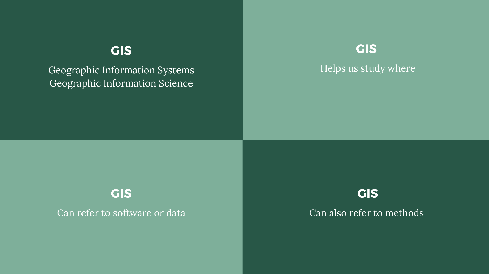
*GIS definitions.*

*John Snow cholera map, 1854.*

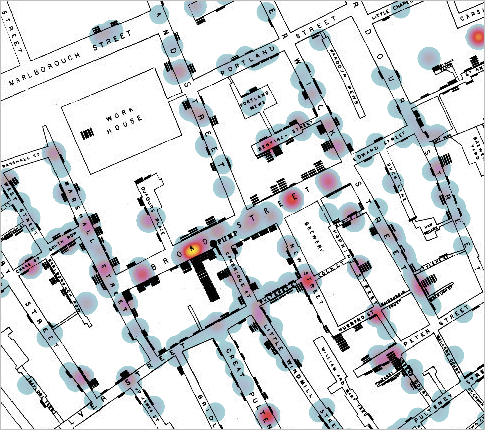

*John Snow cholera map, overlaid by a modern-day GIS heatmap layer.*

## Why GIS

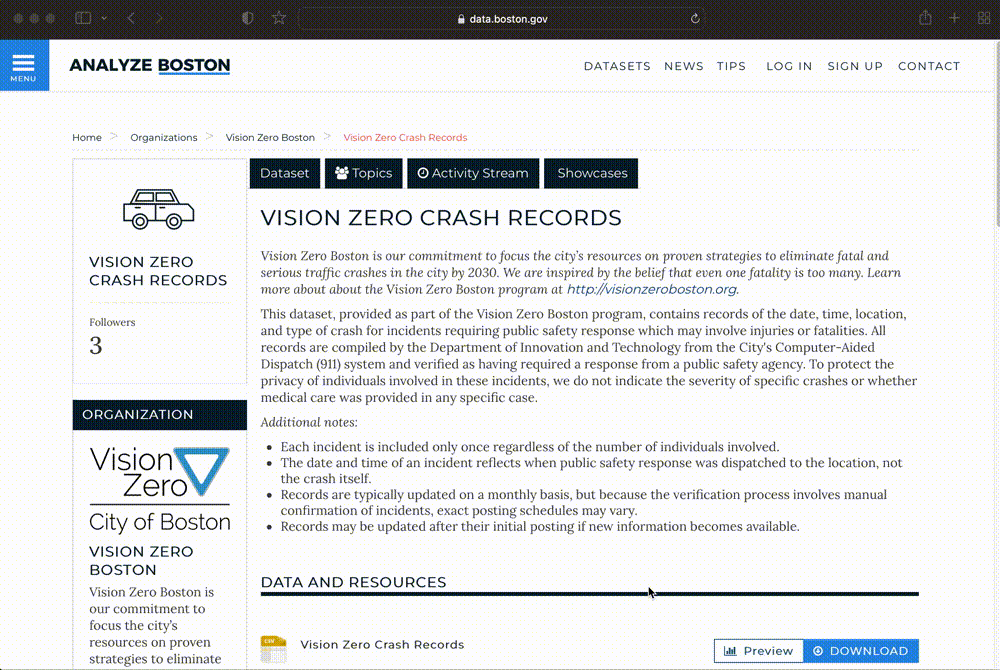
*[Analyze Boston](https://data.boston.gov/group/geospatial), Boston's open data portal.*

*Vision Zero dataset, open as a table.*

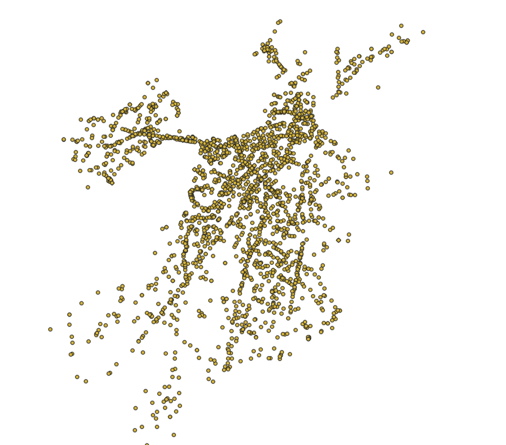
*Bike crash data displayed visually as individual points in GIS software.*

## How we can help

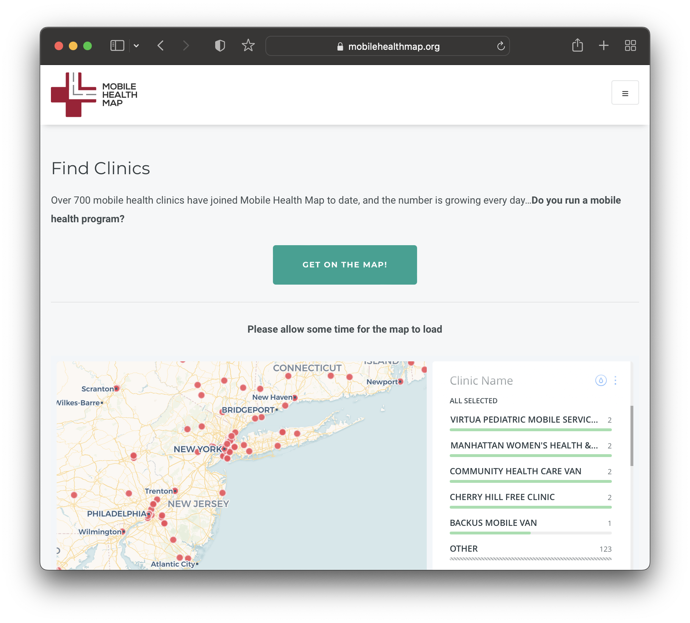

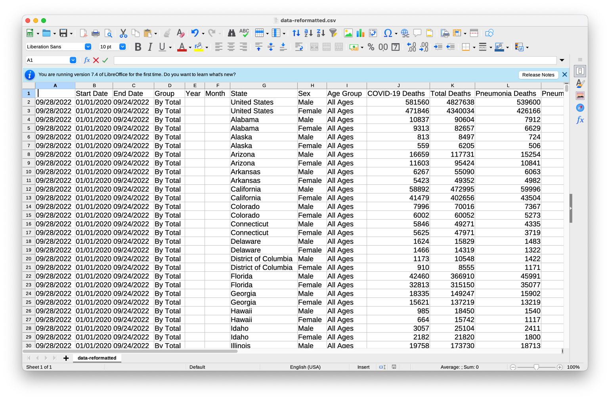
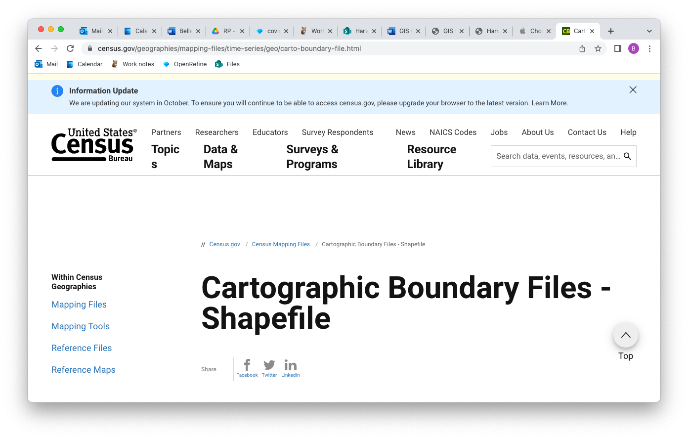
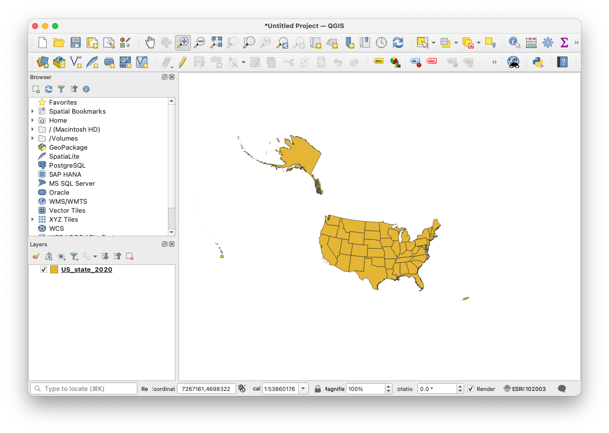
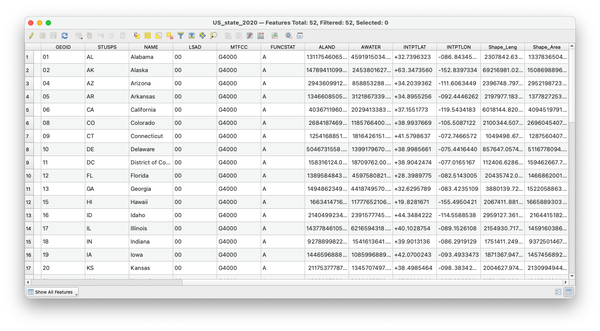
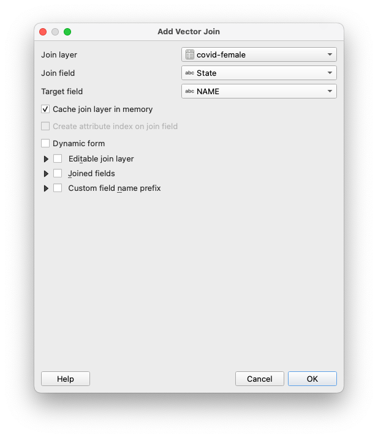
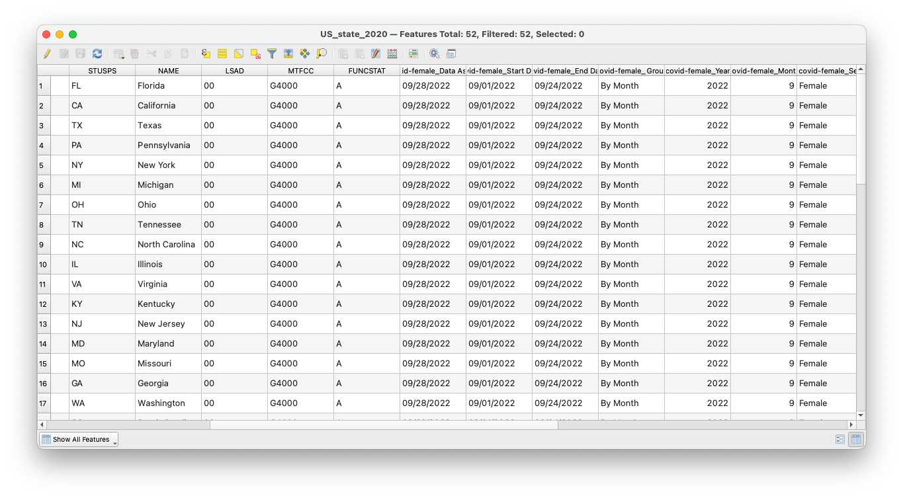

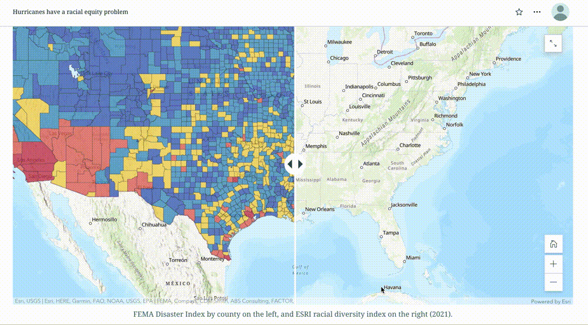

*How to prepare census data for use in a map [tutorial series](https://harvardmapcollection.github.io/tutorials/census/steps/)* 

*[Global volcanoes dataset](https://hgl.harvard.edu/catalog/harvard-glb-volc) in the Harvard Geospatial Library (HGL).* 

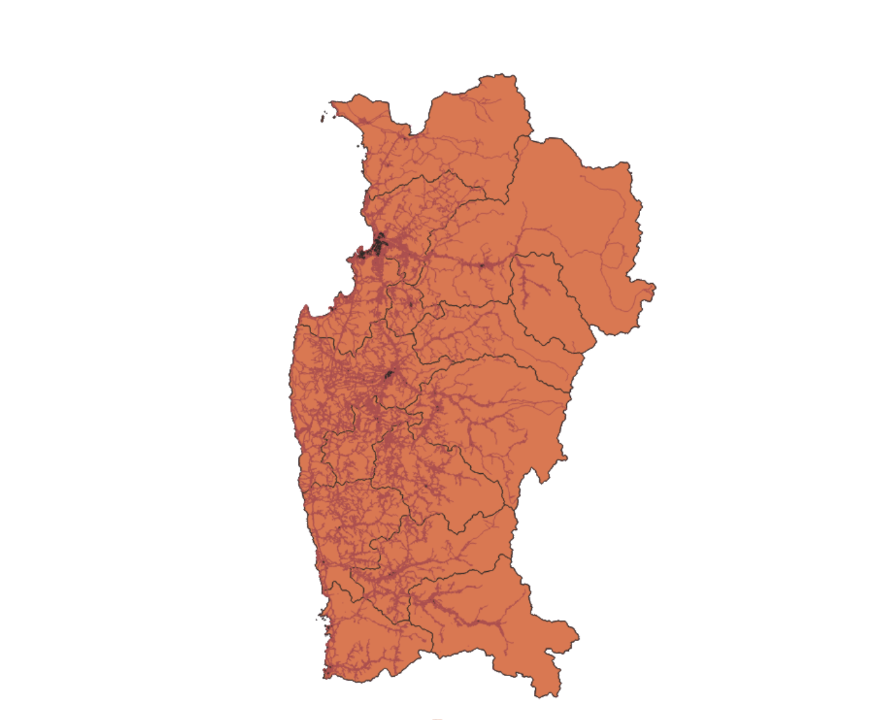

## maps@harvard.edu