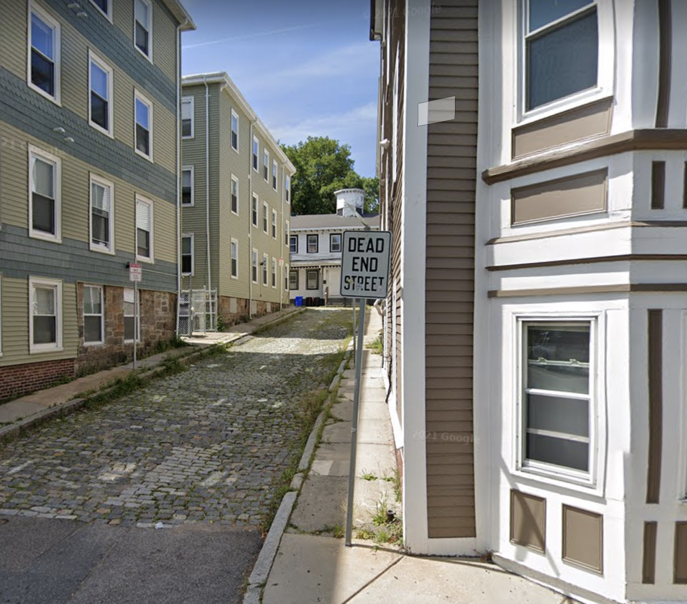
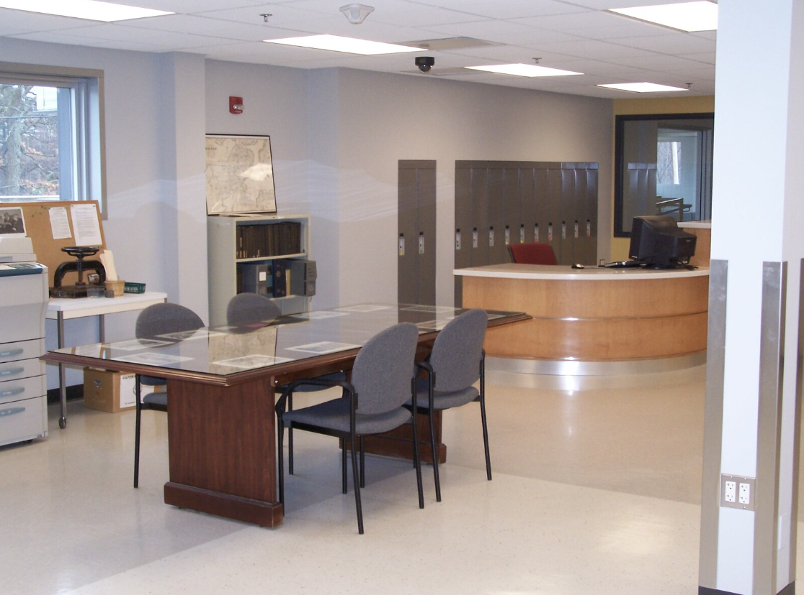
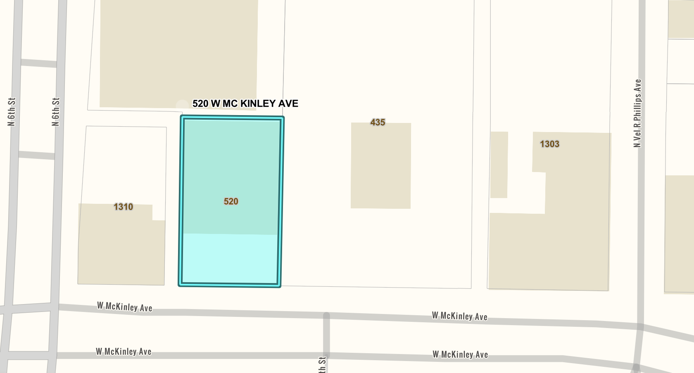
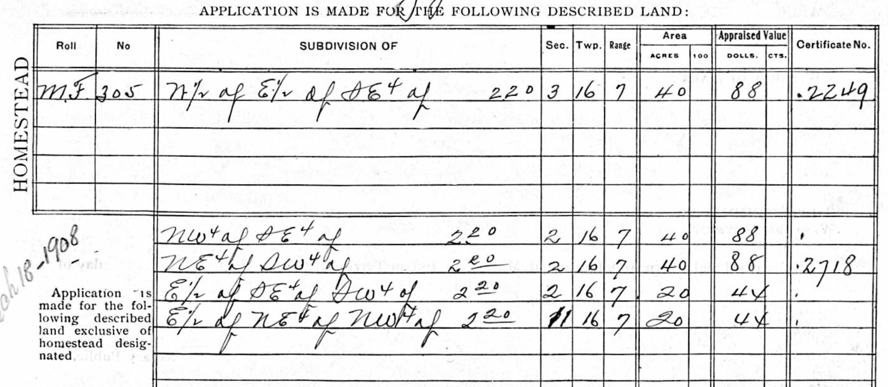
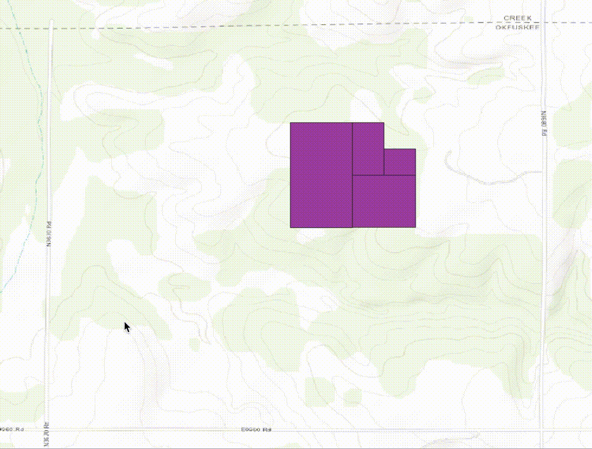
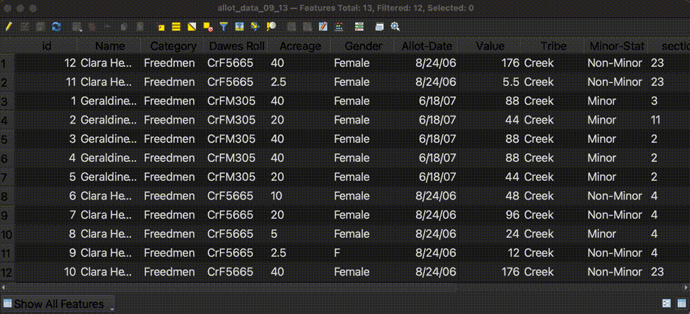
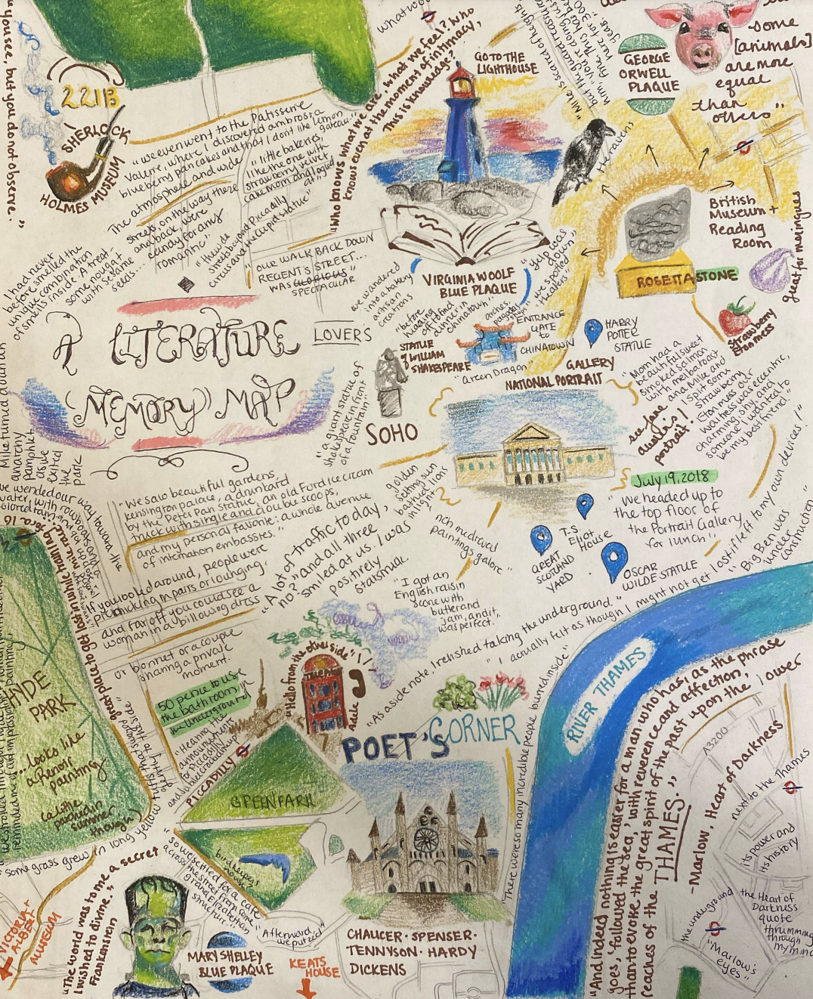

# Using GIS for Property Research

## What is GIS used for?

## GIS definitions

## GIS Data

## Property research with GIS

<iframe width="100%" height="550" src="https://atlascope.leventhalmap.org/#view:embed$base:000$overlay:39999059010718$zoom:18.00$center:-7914725.872110603,5210447.532772563$mode:glass$pos:204"></iframe>

## GIS support from the library

## maps@harvard.edu

You can contact us at [maps@harvard.edu](mailto:maps@harvard.edu).