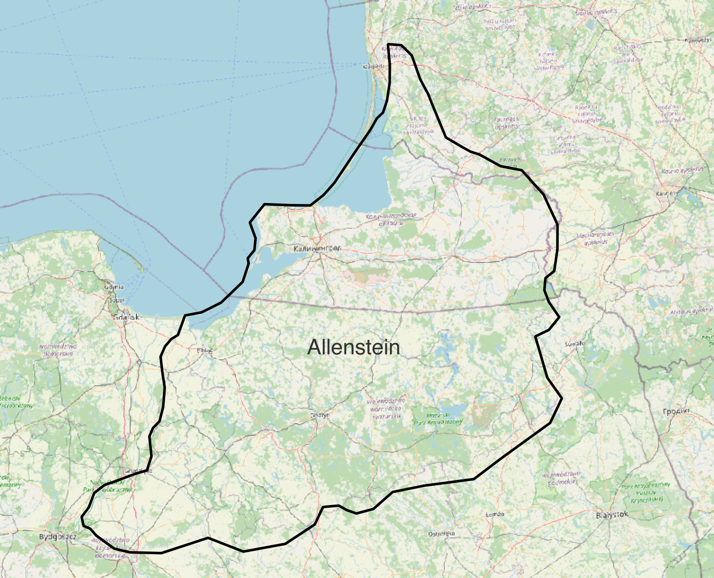
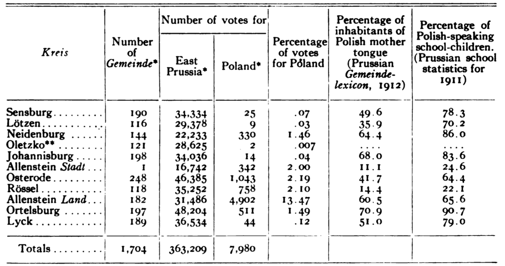

# Data overview

In this tutorial we are going to leverage GIS tools and datasets to study Poland at the end of WWI. By the end, we will have made maps that help us understand the country's demographic makeup at the time. At any point, you can skip ahead to the [maps and datasets](https://harvardmapcollection.github.io/classes/gened1140/fall-2022/assignment/completed). You can download the data from [this Google Drive](https://drive.google.com/file/d/1cKUtwbPIaWjvI_a_zD-Su_fItkA9u5UT/view?usp=sharing). 

We are going to be working with three datasets.

## GIS dataset #1 
A [map showing nationalities in Poland](https://digitalcollections.library.harvard.edu/catalog/990152910700203941) in 1919. We have already georeferenced the map, so it lines up nicely with our other data.

*Here is the map legend showing what we can learn from the map -- the breakdown of nationalities in Poland at the time the map was made, in 1919.*

## GIS Dataset #2 
A polygon dataset representing the extent of the Allenstein plebiscite region. 

*We can use this layer to understand the extent of the region we are studying.*

## GIS Dataset #3 
A point dataset containing statistical information about Polish cities in the 1910s, including spoken languages, and the plebiscite vote results, city by city.
<iframe title="Interactive map of the Polish cities statistical data. Hovering over each city reveals information about the city." src="https://harvardmapcollection.github.io/classes/gened1140/fall-2022/assignment/demo/polish-cities/" width="100%" height="600px"></iframe>
*Hover over each city to display the statistics we will be working with.*

> We created the Polish cities dataset using a table found in *The American Political Science Review*. Here is a link to the _[HOLLIS record](https://hollis.harvard.edu/permalink/f/1mdq5o5/TN_cdi_crossref_primary_10_2307_1947652)_ for the article from which the cities data is derived.

*Table we used to create the GIS data for Polish cities.*