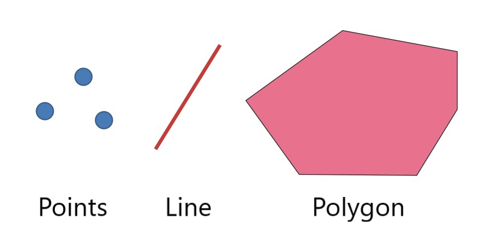
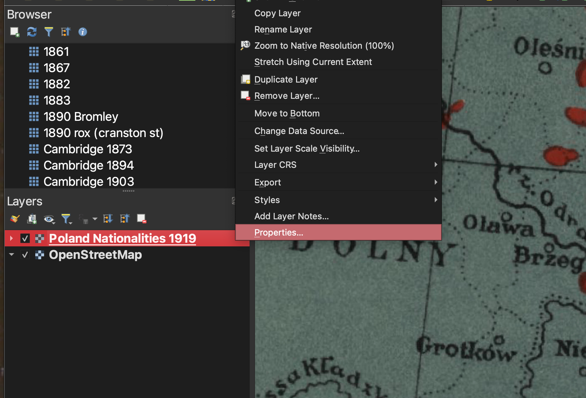
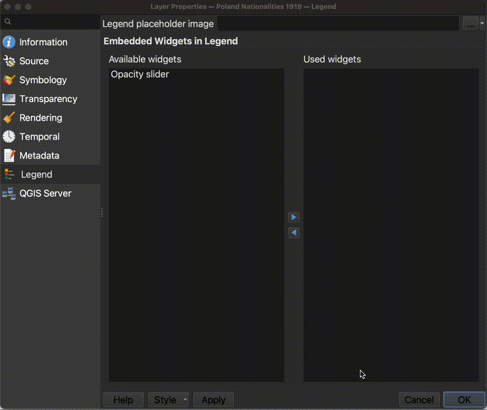

# Mapping Assignment

## What you will learn (and some GIS basics)

In this mapping assignment, you will gain familiarity with the following useful GIS competencies.

### What is GIS?

GIS stands for **G**eographic **I**nformation **S**ystems. GIS helps us study *where*. It is a combination of data sources, software, and methods which allow us to do so. When we say **GIS data**, we mean datasets which have some spatial dimension. These datasets are created in special formats which can be used with special software designed to make maps. The datasets, the software, and the methods all fall under the umbrella of "GIS".

### Common GIS data types

To make your own map someday, you'll need to be comfortable with the two main forms of GIS data: **vector** and **raster** data.

**Vector data** consists of **points, lines and polygons**. 

_GIS vector dataset showing [historic old growth trees in Washington State](https://geo.wa.gov/maps/61db62e6e6864b579e0e36c005e94e71/about) loaded into QGIS, a map making software._

Pictured above is a **points** dataset showing historic old growth trees in Washington State.

When you open the data table, every row in the table represents one of the point features. In this example, that means one row = one tree. Every column in the table is a piece of information about that feature, or tree. For example, in this dataset, we can see there is a column for the age of the tree, and recommendations for caring for that type of tree.

_[Historic old growth trees in Washington State](https://geo.wa.gov/maps/61db62e6e6864b579e0e36c005e94e71/about) dataset in QGIS table view._

GIS software allows us to take tables of features like this and display them visually as a map. 

Here is an example of a **line** dataset of all of the major streams in Massachusetts displayed visually as a map.

Examples of **polygon** vector datasets could be ponds or bodies of water, or political or administrative units. Census data showing counties or census tracts would be polygon data. 

Here is an example of a polygon dataset showing towns in Massachusetts. If you opened the table view of this dataset, each row would represent one Massachusetts town. Each column would contain information about the town. In this case, the attributes include the name of the town, and population statistics from each census year.

Hover over the towns to display **attributes** (column information) for each town/feature/polygon.

<iframe title="Example of polygon data showing towns in Massachussetts you can hover over to expose the column information" src="https://harvardmapcollection.github.io/classes/gened1140/fall-2022/assignment/demo/polygon-data/" width="100%" height="500px"></iframe>

When you are making a GIS map, you can download vector data or create your own. Vector data will usually come in **shapefile** format. The file extension is **.shp**. Some example datasets you could download include:
- road networks (line)
- census data (polygon)
- points of interest like schools, or churches (point)

You can also create your own vector datasets using GIS software, by manually drawing or tracing points, lines, or polygons in a mapping interface, and then typing in any attribute or column information you want to pop up or be visualized from each feature.

The Harvard Map Collection will work with you to find the datasets you need to download for your topic of study, or teach you how to create your own if you think there might not be GIS data readily available.

### Working with georeferenced maps (raster data).

Another common type of GIS data is **raster** data. Instead of points, lines, or polygons, raster data is in the format of image pixels.

When you use Google maps satellite view, you are viewing raster data. The satellite imagery exists in pixels, and it is "spatial data", meaning the computer can tell *where* on the earth the imagery pertains to.

At the Map Collection, we use raster data a lot, because we have so many historical maps, which are in an image format such as `.jpeg` or `.tiff`. We can line these images up to correspond with a spatial location. To do this, we need to perform a process called **georeferencing**.

Georeferencing is the process of lining up an image so it overlays onto modern geography. There are many historical maps created before the time of computers which contain useful information. You can work with that information by georeferencing.

In the example below, you can explore georeferenced old maps of Harvard Square from 1871. In 1871, Felipe's used to be a furniture repair shop! You can scroll to zoom in and out and drag the map around to see more areas. This historical map layer is an example of raster data.

<iframe width="400" height="550" title="Atlascope app zoomed in to Felipes in Harvard Square" src="https://atlascope.leventhalmap.org/#view:embed$base:000$overlay:39999059015436$zoom:19.87$center:-7917105.72511056,5217102.087088008$mode:glass$pos:192"></iframe>
_[Atlascope](https://atlascope.leventhalmap.org/), a tool for exploring historical atlases of Boston._

After this tutorial, you will be able to work with different kinds of GIS data. Then, you will be ready to learn how to analyze or visualize information sources that speak to the *where* of a situation.

## What you will need

In order to work on this assignment, you will need the free, open-source desktop software QGIS. This tutorial will teach you how to download it, and use some of its most useful features. 

There are many software options for manipulating, analyzing, and visualizing geospatial data. QGIS is a favorite, as it is free, lightweight, and doesn't require a login or license. If you learn QGIS now, you'll be able to use it and all of its functionalities long after you graduate.

To download QGIS, visit the [QGIS download page](https://www.qgis.org/en/site/forusers/download.html). Select the `long-term release (most stable)`.

Install the program. 

### Size constraints
The QGIS application is about 3.2GB. If you don't have enough space on your computer, the following places in the library have computers you can use:
- [The Lamont Multimedia Lab](https://library.harvard.edu/services-tools/lamont-multimedia-lab) in B-level of Lamont (drop in hours until 10pm daily)
- [The Map Collection](https://library.harvard.edu/libraries/harvard-map-collection) in Pusey Library (you can drop by between 10-4:30pm M-F, but to assure a time slot, you can email us at [maps@harvard.edu](mailto:maps@harvard.edu))

### Mac users
If you get an error message that Apple can’t check the app for malicious software, right-click the application and select `Open`.

## Tutorial overview

In this tutorial we are going to leverage GIS tools and data to look at demographics in Europe around the time of WWI, and compare them with reconfigured borders in postwar Europe.

To do this, we are going to work with two datasets:
- A [map showing the ethnic and linguistic makeup of Europe](https://iiif.lib.harvard.edu/manifests/view/ids:495027666) in 1910, before the war. We have already georeferenced the map, so it lines up nicely with our other data.

- A vector dataset of the newly established or contested territories after WWI. We created this dataset by georeferencing a map titled, [The Summary of the Treaty of Peace](https://iiif.lib.harvard.edu/manifests/view/ids:495027669e) and tracing the relevant post-war territories. We also assigned qualitative information to each territory noted on the margins of the historical map document.

### Tutorial steps overview

1. Add the ethnic and linguistic map from 1910 to the project
2. Add the post-war territory boundaries from 1919 to the project 
3. Explore these two datasets together as an interactive map
4. Publish the interactive map (optional)

### How to use this tutorial for your assignment

After step 3, you will have a map you can explore to gather insights for your writing assignment. At any time, you can skip to the [finished interactive map](✨✨✨✨✨✨✨✨✨✨✨!!!! ADD LINK!!!!!!!!!!!!!✨✨✨✨✨✨✨). You can also [email us at maps@harvard.edu](mailto:maps@harvard.edu) if anything isn't working how it should be (don't hesitate to ask -- if it's not working for you, it might not be working for others).

If you are interested in GIS, or are considering the mapping option for the final project, following steps 1-3 will give you a great foundation.

Step 4 is optional. The map you make in step 3 will live only on your computer. If you want to learn how to take the work you do in QGIS and turn it into a publicly shareable website, follow step 4. It might also give you ideas for the final project. Skipping this step, however, won't have an impact on your ability to complete today's assignment.

## Tutorial

### Add the ethnic and linguistic map from 1910 to the project

1. If you haven't already, [download and install QGIS](https://harvardmapcollection.github.io/tutorials/qgis/download/).

2. Download [the datasets from this Google Drive link](https://drive.google.com/file/d/1BOqCqDiMXTPN7mrvpIeXuLKwH2TLUtOA/view?usp=sharing).

3. Uncompress the zipped data folders. If you need help unzipping folders, follow [the steps on this website](https://www.sweetwater.com/sweetcare/articles/how-to-zip-and-unzip-files/).

4. Open QGIS.

5. Open a `New Empty Project`.

6. In the left-hand `Browser` menu, find the dropdown titled `XYZ tiles`.

7. Expand the `XYZ tiles` dropown and double-click `OpenStreetMap` to add a basemap to your project. The basemap exists in the background of the project to give us a reference while we are working.

8. In the banner that runs across the top of the QGIS project, find the `Zoom in` button. Select this button. 

9. Click and hold to drag a square around Europe. You can also scroll in and out on your mouse to Zoom in and out. To pan around the map without zooming, engage the `Pan map` button, which looks like a hand.

10. In the very top QGIS program menu, select `Layer → Add Layer → Add Raster Layer`. 

11. In the Data Source Manager, Under `Source`, click the ellipsis next to `Raster dataset(s)`. This will open your computer's files. Navigate to where you downloaded and unzipped the project data. Open the folder titled `raster-data` and select the file `5700_1910_IMG--5700_1910.tif`.

12. Select `Add` and then `Close`. You should be able to see the old map overlaid on the basemap now.

13. Open the layer properties by right-clicking on the map layer `5700_1910_IMG--5700_1910` and selecting `Properties`.

> 5700_1910_IMG--5700_1910 is the Library of Congress call number for the map.

14. Select the `Legend` menu inside the layer properties.

15. To add an opacity sider to be able to "see through" the map to the basemap, click `Opacity slider` and then click the right-pointing arrow to move the slider from `Available widgets` to `Used widgets`. Select `Apply` and `OK`.

16. To see the slider under the layer, you might need to click a dropdown arrow to the left of the layer. When the slider appears, test it out, changing the opacity of the map layer. 

### Add the post-war territory boundaries from 1919 to the project 

1. In the very top QGIS program menu, select `Layer → Add Layer → Add Vector Layer`. 

2. In the Data Source Manager, Under `Source`, click the ellipsis next to `Vector dataset(s)`. This will open your computer's files. Navigate to where you downloaded and unzipped the project data. Open the folder titled `vector-data` and select the file `treaty-summary-1919.shp`.

> In your computer files, a shapefile will appear as multiple different files with the same filename but different file extensions. GIS software reads this set of files as one dataset.

3. Select `Add` and then `Close`. You should see the territory boundaries added to the map.

4. To inspect the data, right-click the `treaty-summary-1919` layer in the layer list and select `Open Attribute Table`. 

5. Drag the column headers to expand the columns. Try to understand the data, observing the values for each polygon. Remember, this dataset was manually created from information found in the explanatory key on [this historical map](https://iiif.lib.harvard.edu/manifests/view/ids:495027669).

> Note how any values selected in the table view are highlighted on the map. 

6. Close the attribute table by clicking the `x` in the upper left-hand corner.

7. Let's change the symbology of the territories layer. Another way to open the layer properties is to double-click the layer. Double-click `treaty-summary-1919`, or right-click the layer, and select `Properties`.

8. Select the `Symbology` tab in the properties menu.

9. Select where it says `Simple fill`. 

10. 

1. Add the dataset
2. Adjust the colors
3. Look at the attributes

### Explore these two datasets together as an interactive map

1. Install QGIS2Web plugin
2. Open it and configure settings
    - etc. etc. etc. 
    - hover on..
    - save as...
3. Export
4. Double-click index.html

### Publish the interactive map (optional)

1. Download Github Desktop client
2. Create a Github account
3. Create a new repository
4. Add the QGIS2web export files to the repository
5. Repository settings > Pages > Turn on GH Pages
6. Share link 