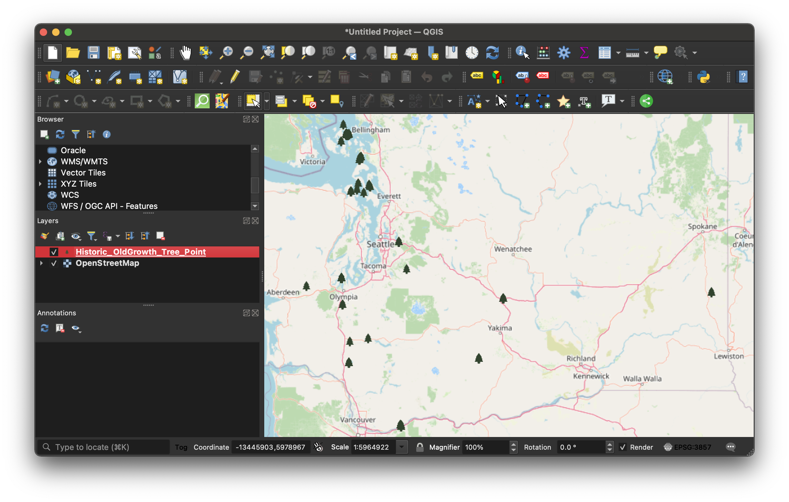
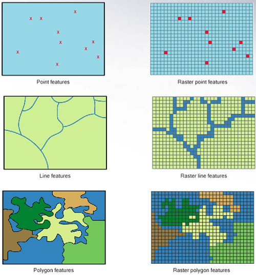

# Mapping Assignment

## What you will learn (and some GIS basics)

In this mapping assignment, you will gain familiarity with the following useful GIS competencies.

### What is GIS?

What is GIS? It stands for **G**eographic **I**nformation **S**ystems. You can think of it as anything related to *where*. When we say "GIS data", we mean datasets which have some information baked in to tell us *where** something occurred. These datasets are created in special formats which can be used with special software designed to make maps. The datasets, the software, and the methods all fall under the umbrella of "GIS".

### Common GIS data types

To make your own map someday, you'll need to be comfortable with the two main forms of GIS data: **vector** and **raster** data.

**Vector data** consists of **points, lines and polygons**. 

_GIS vector dataset in shapefile format of [historic old growth trees in Washington State](https://geo.wa.gov/maps/61db62e6e6864b579e0e36c005e94e71/about) loaded into the QGIS map interface_

Pictured above is a **points** dataset showing historic old growth trees in Washington State.

When you open the data table for a vector dataset, every row in the dataset is one of the point features, in this example, one tree. Every column in the point dataset is a piece of information about that feature. For example, in the data table for this tree dataset, we can see there is a column for the age of the tree (how old it is), and recommendations for pruning that type of tree.

_GIS vector dataset in shapefile format showing [historic old growth trees in Washington State](https://geo.wa.gov/maps/61db62e6e6864b579e0e36c005e94e71/about) in QGIS table view._

GIS software allows us to take tables of features like this and display them visually as a map. 

Here is an example of a **line** dataset showing rivers in Massachusetts.

Examples of polygon vector datasets could be ponds or bodies of water, or political or administrative units. Census data showing counties or census tracts would be polygon data. 

Here is an example of a polygon dataset showing towns in Massachusetts. In this data table, each row would be one Massachusetts town. Each column would be a fact about the town, in this case, the name of the town, and population statistics from each census year.
You can click on the towns to expose each polygon feature's **attributes** (column information).

<iframe title="Example of polygon data showing towns in Massachussetts you can hover over to expose the column information" src="https://harvardmapcollection.github.io/classes/gened1140/fall-2022/assignment/demo/polygon-data/" width="100%" height="500px"></iframe>

When you are making a GIS map, you can download vector data or create your own. Vector data will usually come in **shapefile** format. The file extension is **.shp**. Some example datasets you could download include:
- road networks (line)
- census data (polygon)
- points of interest like schools, or churches (point)

You can also create your own vector datasets using GIS software, by manually drawing or tracing points, lines, or polygons on the map, and then typing in any attribute or column information you want to pop up or be visualized.

The Harvard Map Collection can work with you to find the datasets you need to download, or teach you how to create your own if you think there might not be GIS data available already.

### Working with georeferenced maps (raster data).

Another common type of GIS data is **raster** data. Instead of points, lines, or polygons, raster data is in the format of image pixels.

This is a common GIS file format because people want to work with satellite or aerial imagery, or scans of old maps. 

To get the images to line up on the map canvas, we need to perform a process called **georeferencing**.

Georeferencing is the process of lining up an old map so it overlays on modern geography. There are many historical maps created before the time of computers which contain useful information. Knowing how to work with georeferenced maps will allow you to take a digital scan of any old map and use it with other GIS datsets.

In the example below, you can explore georeferenced old maps of Harvard Square from 1871. In 1871 Felipe's used to be a furniture repair shop. This old map layer is an example of raster data.

<iframe width="400" height="550" title="Atlascope app zoomed in to Felipes in Harvard Square" src="https://atlascope.leventhalmap.org/#view:embed$base:000$overlay:39999059015436$zoom:19.87$center:-7917105.72511056,5217102.087088008$mode:glass$pos:192"></iframe>
_[https://atlascope.leventhalmap.org/](Atlascope), a tool for exploring historical atlases of Boston._

After this tutorial, you will be more comfortable with being able to work with GIS datasets inside mapping software, which will allow you to explore more topics through a map-based format.

## What you will need

In order to work on this assignment, you will need the free, open-source desktop software QGIS. This tutorial will teach you how to download it, and use some of it's most useful features. 

There are many software options for working with, manipulating, analyzing, and visualizing geospatial data. QGIS is a favorite, as it is free, lightweight, and doesn't require a login or license. If you learn QGIS now, you'll be able to use it and all of its functionalities long after you graduate.

To download QGIS, visit the [QGIS download page](https://www.qgis.org/en/site/forusers/download.html). Select the `long-term release (most stable)`.

Install the program. 

### Size constraints
The QGIS application is about 3.2GB. If you don't have enough space on your computer, the following places in the library have computers you can use:
- [The Lamont Multimedia Lab](https://library.harvard.edu/services-tools/lamont-multimedia-lab) in B-level of Lamont (drop in hours until 10pm daily)
- [The Map Collection](https://library.harvard.edu/libraries/harvard-map-collection) in Pusey Library (you can drop by between 10-4:30pm M-F, but to assure a time slot, you can email us at [maps@harvard.edu](mailto:maps@harvard.edu))

### Mac users
If you get an error message that Apple can’t check the app for malicious software, right-click the application and select `Open`.

## Steps overview

## Steps

## Optional steps 

(publish the map to Github)