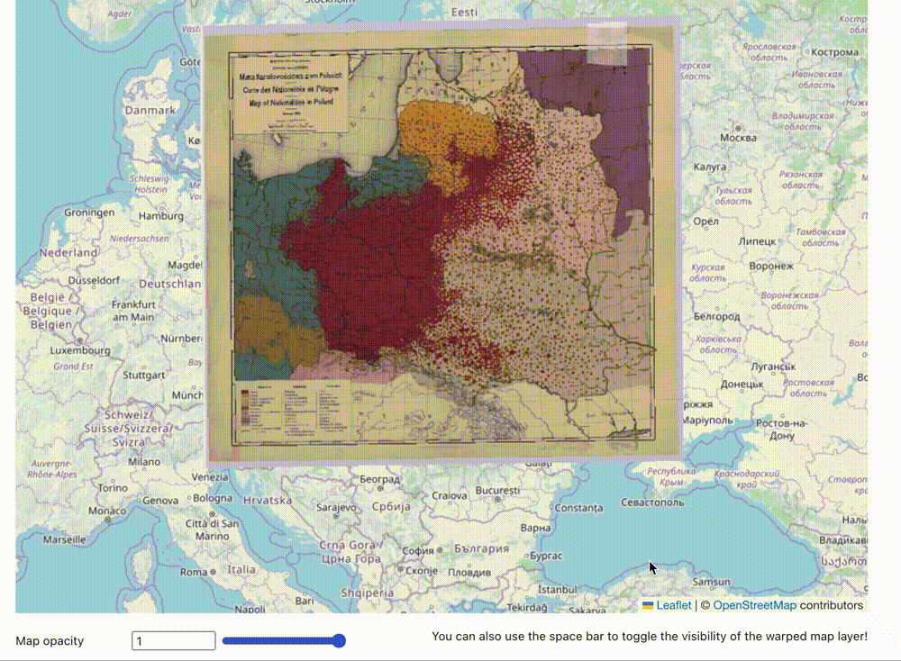
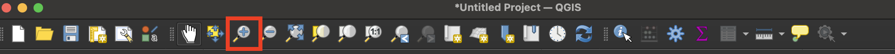
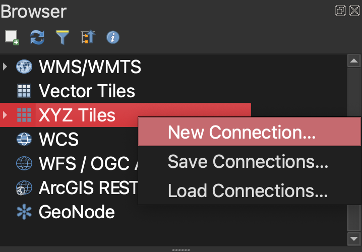
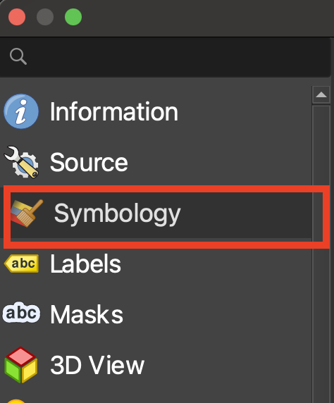
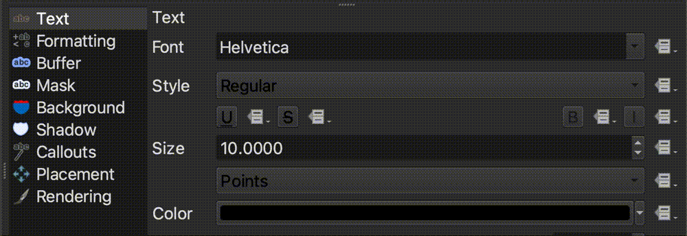
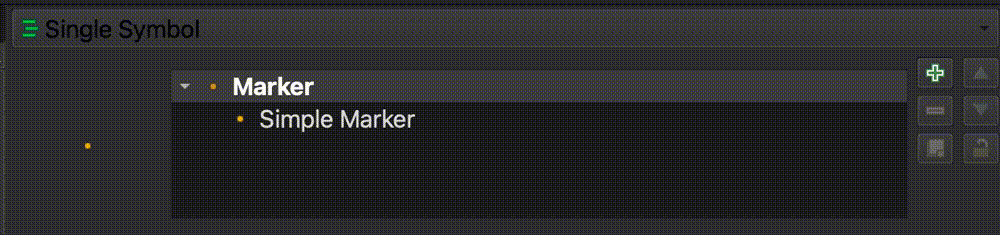
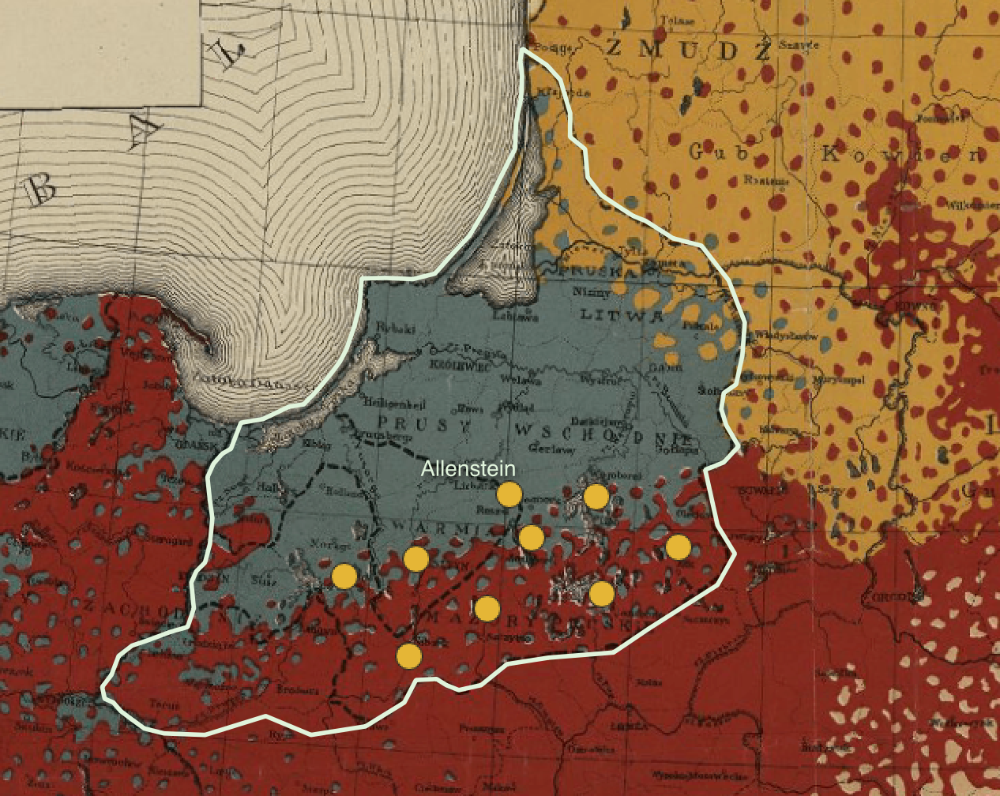
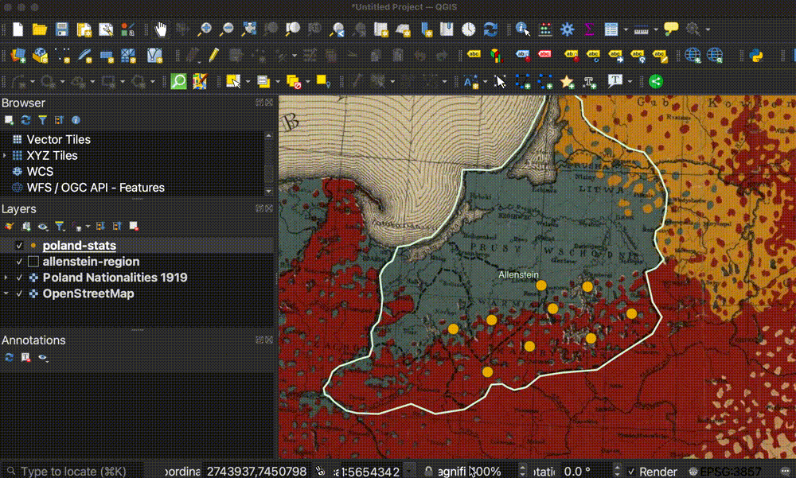
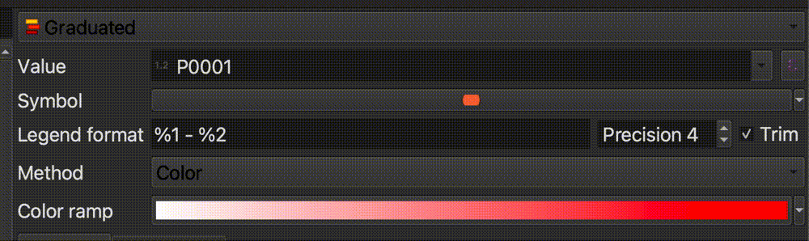
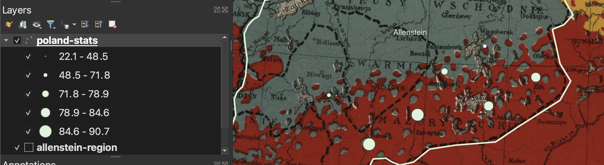

# Mapping Assignment

## What you will learn (and some GIS basics)

In this mapping assignment, you will gain familiarity with the following useful GIS competencies.

### What is GIS?

GIS stands for **G**eographic **I**nformation **S**ystems. GIS helps us study *where*. It is a combination of data sources, software, and methods which allow us to do so. When we say **GIS data**, we mean datasets which have some spatial dimension. These datasets are created in special formats which can be used with special software designed to make maps. The datasets, the software, and the methods all fall under the umbrella of "GIS".

### Common GIS data types

To make your own map someday, you'll need to be comfortable with the two main forms of GIS data: **vector** and **raster** data.

**Vector data** consists of **points, lines and polygons**. 

_GIS vector dataset showing [historic old growth trees in Washington State](https://geo.wa.gov/maps/61db62e6e6864b579e0e36c005e94e71/about) loaded into QGIS, a map making software._

Pictured above is a **points** dataset showing historic old growth trees in Washington State.

When you open the data table, every row in the table represents one of the point features. In this example, that means one row = one tree. Every column in the table is a piece of information about that feature, or tree. For example, in this dataset, we can see there is a column for the age of the tree, and recommendations for caring for that type of tree.

_[Historic old growth trees in Washington State](https://geo.wa.gov/maps/61db62e6e6864b579e0e36c005e94e71/about) dataset in QGIS table view._

GIS software allows us to take tables of features like this and display them visually as a map. 

Here is an example of a **line** dataset of all of the major streams in Massachusetts displayed visually as a map.

Examples of **polygon** vector datasets could be ponds or bodies of water, or political or administrative units. Census data showing counties or census tracts would be polygon data. 

Here is an example of a polygon dataset showing towns in Massachusetts. If you opened the table view of this dataset, each row would represent one Massachusetts town. Each column would contain information about the town. In this case, the attributes include the name of the town, and population statistics from each census year.

Hover over the towns to display **attributes** (column information) for each town/feature/polygon.

<iframe title="Example of polygon data showing towns in Massachussetts you can hover over to expose the column information" src="https://harvardmapcollection.github.io/classes/gened1140/fall-2022/assignment/demo/polygon-data/" width="100%" height="500px"></iframe>

When you are making a GIS map, you can download vector data or create your own. Vector data will usually come in **shapefile** format. The file extension is **.shp**. Some example datasets you could download include:
- road networks (line)
- census data (polygon)
- points of interest like schools, or churches (point)

You can also create your own vector datasets using GIS software, by manually drawing or tracing points, lines, or polygons in a mapping interface, and then typing in any attribute or column information you want to pop up or be visualized from each feature.

The Harvard Map Collection will work with you to find the datasets you need to download for your topic of study, or teach you how to create your own if you think there might not be GIS data readily available.

### Working with georeferenced maps (raster data).

Another common type of GIS data is **raster** data. Instead of points, lines, or polygons, raster data is in the format of image pixels.

When you use Google maps satellite view, you are viewing raster data. The satellite imagery exists in pixels, and it is "spatial data", meaning the computer can tell *where* on the earth the imagery pertains to.

At the Map Collection, we use raster data a lot, because we have so many historical maps, which are in an image format such as `.jpeg` or `.tiff`. We can line these images up to correspond with a spatial location. To do this, we need to perform a process called **georeferencing**.

Georeferencing is the process of lining up an image so it overlays onto modern geography. There are many historical maps created before the time of computers which contain useful information. You can work with that information by georeferencing.

In the example below, you can explore georeferenced old maps of Harvard Square from 1871. In 1871, Felipe's used to be a furniture repair shop! You can scroll to zoom in and out and drag the map around to see more areas. This historical map layer is an example of raster data.

<iframe width="400" height="550" title="Atlascope app zoomed in to Felipes in Harvard Square" src="https://atlascope.leventhalmap.org/#view:embed$base:000$overlay:39999059015436$zoom:19.87$center:-7917105.72511056,5217102.087088008$mode:glass$pos:192"></iframe>
_[Atlascope](https://atlascope.leventhalmap.org/), a tool for exploring historical atlases of Boston._

After this tutorial, you will be able to work with different kinds of GIS data. Then, you will be ready to learn how to analyze or visualize information sources that speak to the *where* of a situation.

## What you will need

In order to work on this assignment, you will need the free, open-source desktop software QGIS. This tutorial will teach you how to download it, and use some of its most useful features. 

There are many software options for manipulating, analyzing, and visualizing geospatial data. QGIS is a favorite, as it is free, lightweight, and doesn't require a login or license. If you learn QGIS now, you'll be able to use it and all of its functionalities long after you graduate.

To download QGIS, visit the [QGIS download page](https://www.qgis.org/en/site/forusers/download.html). Select the `long-term release (most stable)`.

Install the program. 

### Size constraints
The QGIS application is about 3.2GB. If you don't have enough space on your computer, the following places in the library have computers you can use:
- [The Lamont Multimedia Lab](https://library.harvard.edu/services-tools/lamont-multimedia-lab) in B-level of Lamont (drop in hours until 10pm daily)
- [The Map Collection](https://library.harvard.edu/libraries/harvard-map-collection) in Pusey Library (you can drop by between 10-4:30pm M-F, but to assure a time slot, you can email us at [maps@harvard.edu](mailto:maps@harvard.edu))

### Mac users
If you get an error message that Apple can’t check the app for malicious software, right-click the application and select `Open`.

## Tutorial overview

In this tutorial we are going to leverage GIS tools and datasets to study Poland at the end of WWI. By the end, we will have made maps that help us understand the country's demographic makeup at the time. At any point, you can skip ahead to the [maps and datasets](https://harvardmapcollection.github.io/classes/gened1140/fall-2022/assignment/completed). 

We are going to be working with three datasets.

### GIS dataset #1 
A [map showing nationalities in Poland](https://digitalcollections.library.harvard.edu/catalog/990152910700203941) in 1919. We have already georeferenced the map, so it lines up nicely with our other data.

*Here is the map legend showing what we can learn from the map -- the breakdown of nationalities in Poland at the time the map was made, in 1919.*

### GIS Dataset #2 
A polygon dataset representing the extent of the Allenstein plebiscite region.

*We can use this layer to understand the extent of the region we are studying.*

### GIS Dataset #3 
A point dataset containing statistical information about Polish cities in the 1910s, including spoken languages, and the plebiscite vote results, city by city.
<iframe title="Interactive map of the Polish cities statistical data. Hovering over each city reveals information about the city." src="https://harvardmapcollection.github.io/classes/gened1140/fall-2022/assignment/demo/polish-cities/" width="100%" height="600px"></iframe>
*Hover over each city to display the statistics we will be working with.*

> We created the Polish cities dataset using a table found in *The American Political Science Review*. Here is a link to the _[HOLLIS record](https://hollis.harvard.edu/permalink/f/1mdq5o5/TN_cdi_crossref_primary_10_2307_1947652)_ for the article from which the cities data is derived.

*Table we used to create the GIS data for Polish cities.*

## Tutorial

If you are having trouble with this tutorial, please don't hesitate to reach out to [maps@harvard.edu](mailto:maps@harvard.edu).

### Adding the raster dataset to the GIS project

1. If you haven't already, [download and install QGIS](https://harvardmapcollection.github.io/tutorials/qgis/download/).

2. Open QGIS.

3. Open a `New Empty Project`.

4. In the left-hand `Browser` menu, find the dropdown titled `XYZ tiles`.

5. Expand the `XYZ tiles` dropown and double-click `OpenStreetMap` to add a basemap to your project. The basemap exists in the background of the project to give us a reference while we are working.

6. In the banner that runs across the top of the QGIS project, find the `Zoom in` button. Select this button. 

7. Click and hold to drag a square around Europe. You can also scroll in and out on your mouse to Zoom in and out. To pan around the map without zooming, engage the `Pan map` button, which looks like a hand.

8. In the left-hand browser menu, right-click `XYZ Tiles` and select `New Connection`. 

> We are adding the map of Poland nationalities. This map has already been georeferenced. Georeferencing maps like this one allows us to overlay it onto other maps and directly compare maps and data of the same area. The map is currently hosted online as a streaming data layer. We can bring it into our project by specifying in QGIS what the layer URL is.

9. In the XYZ Connection wizard, title the new layer `Poland Nationalities 1919`.

10. Copy and paste the following link into where it asks for a URL: `https://allmaps.xyz/maps/8d5cc5d1fec615d6/{z}/{x}/{y}.png`

> To learn how we georeferenced this [map from our Digital Collections](https://iiif.lib.harvard.edu/manifests/view/ids:445002895), you can follow [this tutorial](https://harvardmapcollection.github.io/tutorials/allmaps/georeference/).  

11. Accept all other defaults. Select `OK`.

12. Make sure the dropdown caret next to `XYZ Tiles` in the browser menu is expanded. To add the Poland Nationalities 1919 map layer to your QGIS project, double-click on `Poland Nationalities 1919`. You should be able to see the old map overlaid on the basemap now. 
> It might take a few moments to render. As you zoom in and pan around, you are querying the map data at different zoom levels. The resolution should improve as it finishes loading.

### Adding the vector datasets to the GIS project

1. Download [the zipped data from this Google Drive link](https://drive.google.com/file/d/1OooI5tdRmhADD3_cR5jIrqfUnKRMGEaU/view?usp=sharing).

2. Uncompress the zipped data folder. If you need help unzipping folders, follow [the steps on this website](https://www.sweetwater.com/sweetcare/articles/how-to-zip-and-unzip-files/).

3. In the very top QGIS program menu, select `Layer → Add Layer → Add Vector Layer`. 

4. In the Data Source Manager, Under `Source`, click the ellipsis next to `Vector dataset(s)`. This will open your computer's files. Navigate to where you downloaded and unzipped the project data. In the `allenstein-region` folder, select the file `allenstein-region.shp`.

5. Select `Open`.

6. Select `Add` and `Close`. The `allenstein-region` layer should now appear in your layer list, and on your map.

6. Follow the same prompts to add the Polish cities statistical data. In the Data Source Manager, Under `Source`, click the ellipsis next to `Vector dataset(s)`. This will open your computer's files. Navigate to where you downloaded and unzipped the project data. In the `poland-stats` folder, select the file `poland-stats.shp`.

5. Select `Open`.

6. Select `Add` and `Close`. The `poland-stats` layer should now appear in your layer list, and on your map. Your map document should look something like this. 

*All three layers, the georeferenced map, the allenstein region, and the polish cities statistics.*

7. Let's make this data a little easier to work with. Double-click the `allenstein-region` layer in the `Layers Panel`. This will open up the `Layer Properties` for the `allenstein-region` shapefile. 

8. Select the `Symbology` tab from the Layer Properties menu.

9. We want to change the symbology on the plebiscite region layer so that instead of QGIS symbolizing the region as a solid shape, it is just a border around the region. Select where it says `Simple Fill`.

10. In the `Fill Style` drop-down, change `Solid` to `No Brush`.

11. Let's change the border outline, or "Stroke", to a color and width that appears a bit more prominently against the detail of the bold colors on the historic map. Click the colorful bar which appears to the right of the `Stroke Color` option to open the `Select Stroke Color` menu.

12. We're going to use a light greenish color which will pop against the map background. Paste the color code for this color into where it says `HTML notation`. The value to paste in is `#e0f3db`

> To learn more about color codes, check out [htmlcolorcodes.com](https://htmlcolorcodes.com/).

13. Increase the `Stroke Width` to `1.0`.

14. Select `OK`

15. This works better for us, because now we can see the extent of the plebiscite region, but can also "peer under" the layer to see the details of the historic map. Your map should look something like this.

16. Now let's label the Allenstein region. Double-click the `allenstein-region` layer in the `Layers Panel` again, to open up the `Layer Properties`.
 

17. Select the `Labels` tab in the `Layer Properties` menu.

18. Select the drop-down that says `No Labels`, and change it to `Single Labels`.

19. Select the `Text` tab, and change the size of the label to `14.0`.

20. Click the color bar next to `Color` and paste `#eee` as the color code into the `HTML notation` field.  

21. Let's add a drop shadow to make the label stand out better against the map background. Select the label tab called `Shadow`, and toggle on `Draw drop shadow`.

22. Select `OK`. Your map should now look like this, with the Allenstein region outlined and labeled. 

23. The points representing the Polish cities in the `poland-stats` layer are also quite small and difficult to see. Let's make them bigger. Double-click the `poland-stats` layer in the `Layers Panel` to open the `Layer Properties`. 

24. Select the `Symbology` tab.

25. Select where it says `Simple Marker`.

25. In the text box next to `Size`, change the marker size to `6.0`.

26. Select `OK`. Your map should look something like this.

### Exploring the Polish cities dataset

1. Now, let's familiarize ourselves with the Polish cities statistical data. Right-click on the `poland-stats` layer in the `Layer Panel` and select `Open Attribute Table`. 

2. You should see a table where each row is one of the Polish cities on the map, and each layer is a statistical figure about that city. Take a look and try to make sense of the table.

3. You may have noticed that the field headers are not easy to understand. This is common when working with datasets. Because column headers have character limits, datasets often come with codes as the field headers, and you must use what is called a **codebook** to interpret what the columns mean. In the data you downloaded for this activity, navigate to `poland-stats` and open the file `poland-stats-codebook.csv`. 

4. Revisit the Polish cities attribute table and use the codebook to make sense of the values in the table. What do you notice?

### Using map symbology to notice trends

1. While we can observe the values in tabular format, it is difficult to understand trends looking at a list of statistics. Let's try to symbolize some of these values on the map and see what we can learn. Double-click the `poland-stats` layer in the `Layer Panel` to open the `Layer Properties`.

2. Select the `Symbology` menu tab.

3. Engage the drop down that says `Single Symbol`, and change it to `Graduated`.

> QGIS had been symbolizing each city with the same, singular symbology. We are now telling it we want to symbolize the values so they gradually get larger based on the values within our data.

4. We need to tell the program *which* column or attribute we want to create graduated symbology based on. Let's select `P0001`, which as we learned from our codebook, is the percent of Polish-speaking school children in each city. Use the drop-down next to `Value` and select `P0001`.

5. Change the `Method` from `Color` to `Size`.

7. Select `Classify` in the bottom-left corner of the symbology interface.

8. Select `OK`. We can now see the spatial breakdown of where cities with high percentages of Polish-speaking school children lived. 

9. If we consult the legend from our historcal map, we can remember that `red` represents Polish, and `blue` represents Germans. We can compare this demographic breakdown on the historic map from 1919 with the pattern we are seeing in the Polish-speaking school children data from 1911. 

10. Now let's compare this nationality data against the results of the plebiscite vote. This is the data we are going to use to make our finished map. We are going to compare the votes for East Prussia (or Germany) against the votes for Poland. Double-click the `poland-stats` layer in the `Layer Panel` to open the `Layer Properties`. 

11. Under the `Symbology` tab, engage the drop-down that reads `Graduated`, and change it to `No Symbols`.

> We are going to emulate the comparative proportional symbol style of this hand-drawn map in the Harvard Map Collection's digital collections. This map from 1911 shows Polish school children (in black) compared to German school children (in white) in the pie charts, scaled by size depending on the total number of children who lived in that city. We are going to apply the same symbology to look at votes for Germany vs. votes for Poland in the plebiscite result. 

12. The QGIS program handles pie-chart maps as `Diagrams`, rather than `Symbology`, as we have been working with so far. Click the `Diagrams` tab in the `Layer Properties`. 

13. Engage the drop-down that says `No Diagram`, and change it to `Pie Charts`.

14. Recall from our codebook that the columns `P0005` and `P0006` represented percent of votes for East Prussia vs votes for Poland, respectively. Add these two variables to the pie chart diagram, by highlighting one at a time, and selecting the `Add Selected Attributes` button, which looks like a green plus sign.

15. Double-click each of the `Assigned Attributes` color squares to change the color. For `P0005`, or East Prussia, paste in the HTML color code `#eee`. For `P0006`, or Poland, paste in the color code `#000`. 

16. In the `Size` tab of the `Diagram` Properties, change the size from `Fixed Size` to `Scaled Size`. 

17. Fill out the rest of this dialog box as follows:
> - For the `Attribute`, select `P0003`, because we want to scale the symbols by the total number of votes.
- Next to `Maximum value`, click the `Find` button to let it automatically generate the maximum value from the dataset.
- Set the size to `10.0`, and switch the `Scale` from `Area` to `Diameter`.
The dialog box should look like this when you're all done:

### Designing a shareable map “for print” 