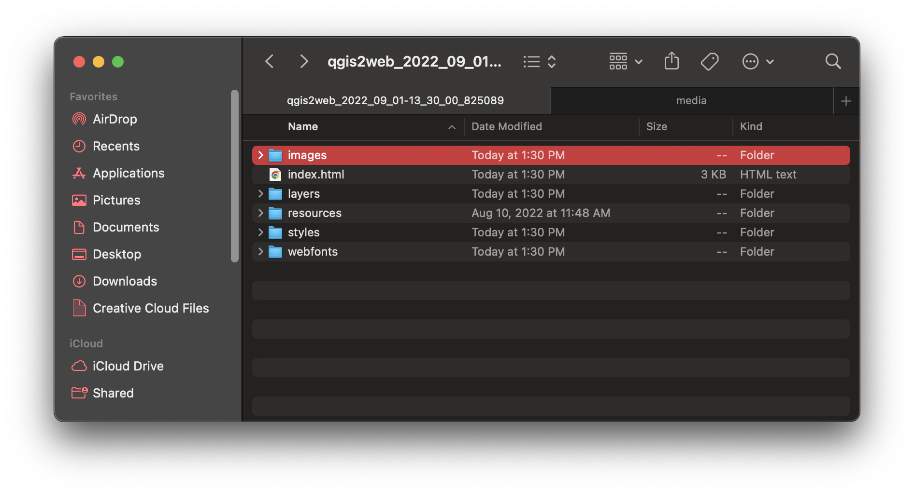

# Mapping Assignment Next Steps 

In the [first part of the mapping tutorial](https://harvardmapcollection.github.io/classes/gened1140/fall-2022/assignment/), we learned how to bring in two different kinds of GIS data into a desktop GIS program, QGIS. 

In this part of the tutorial, we will learn how to make any map you create in QGIS web-enabled. To do this, we will use a QGIS plugin called "QGIS2Web"

## Share the project as a webmap

1. In the very top QGIS program menu, select `Plugins → Manage and Install Plugins`. 


2. Search for `QGIS2Web` and select `Install plugin`.

3. In the very top QGIS program menu, select `Web → QGIS2Web → Create a webmap`. 


4. Configure the `Layers and Groups` settings as follows:

> - Make sure all of the layers are toggled on, including the basemap
- Make sure all of the layers are toggled on as `Visible`
- Toggle on `Popups` only for the `treaty-summary-1919` territories; make sure `Popups` are turned **off** for the other data layers. 
- Under `treaty-summary-1919` `Popup fields`, use the dropdowns to select `header label` for each field. 
*To learn more about configuring popups, you can follow this guide, [Web Mapping with QGIS2Web](http://www.qgistutorials.com/en/docs/web_mapping_with_qgis2web.html).*

5. Configure the `Appearance` settings as follows:

> - Under `Add layers list` select `Expanded`
- Toggle on the checkbox next to `Show popups on hover`

6. Under the `Export` tab, click the ellipsis to the right of where it says `Export to folder`. Select a place to save your webmap to. Choose somewhere easy to find. Select open.


7. Select export. It might take a few moments to complete the export. 

8. When the `Progress` bar says `Success, exported to your location`, navigate to that location in your computer files. 

9. Double-click `index.html`. The interactive webmap you created will appear in your default web browser. You can use this map to explore the relationships between nationality and political boundary-making in Europe in 1919.


### Publish the interactive map 

The interactive webmap you created currently lives only on your computer. To share the link publicly (as we did with [the demo](https://harvardmapcollection.github.io/classes/gened1140/fall-2022/assignment/demo/completed-map/)), you will need to follow a few more steps. 

The QGIS2Web plugin exports your webmap as a series of website files. They look like this.


If you were to open `index.html` in a text editor, the file would look like this. It is website code: HTML, CSS, and JavaScript.
```
<!doctype html>
<html lang="en">
    <head>
        <meta charset="utf-8">
        <meta http-equiv="X-UA-Compatible" content="IE=edge">
        <meta name="viewport" content="initial-scale=1,user-scalable=no,maximum-scale=1,width=device-width">
        <meta name="mobile-web-app-capable" content="yes">
        <meta name="apple-mobile-web-app-capable" content="yes">
        <link rel="stylesheet" href="./resources/ol.css">
        <link rel="stylesheet" href="resources/fontawesome-all.min.css">
        <link rel="stylesheet" href="./resources/ol-layerswitcher.css">
        <link rel="stylesheet" href="./resources/qgis2web.css">
<style>
.search-layer {
  top: 65px;
  left: .5em;
}
.ol-touch .search-layer {
  top: 80px;
}
</style>
        <style>
        html, body {
            background-color: #ffffff;
        }
        .ol-control button {
            background-color: #f8f8f8 !important;
            color: #000000 !important;
            border-radius: 0px !important;
        }
        .ol-zoom, .geolocate, .gcd-gl-control .ol-control {
            background-color: rgba(255,255,255,.4) !important;
            padding: 3px !important;
        }
        .ol-scale-line {
            background: none !important;
        }
        .ol-scale-line-inner {
            border: 2px solid #f8f8f8 !important;
            border-top: none !important;
            background: rgba(255, 255, 255, 0.5) !important;
            color: black !important;
        }
        </style>
        <style>
        html, body, #map {
            width: 100%;
            height: 100%;
            padding: 0;
            margin: 0;
        }
        </style>
        <title></title>
    </head>
    <body>
        <div id="map">
            <div id="popup" class="ol-popup">
                <a href="#" id="popup-closer" class="ol-popup-closer"></a>
                <div id="popup-content"></div>
            </div>
        </div>
        <script src="resources/qgis2web_expressions.js"></script>
        <script src="resources/polyfills.js"></script>
        <script src="./resources/functions.js"></script>
        <script src="./resources/ol.js"></script>
        <script src="./resources/ol-layerswitcher.js"></script>
        <script src="layers/TreatySummary1919_2.js"></script>
        <script src="styles/TreatySummary1919_2_style.js"></script>
        <script src="./layers/layers.js" type="text/javascript"></script> 
        <script src="./resources/Autolinker.min.js"></script>
        <script src="./resources/qgis2web.js"></script>
    </body>
</html>
```

We can share this code on the free code hosting platform, Github. We can display it as a website using another tool on that platform, called Github pages.

## Step by step

1. First, you will need a [free Github account](https://github.com/join). 

2. Next, you will need the desktop software that comes along with Github, called [Github Desktop](https://desktop.github.com/).

3. Using Github Desktop, you should complete the following steps:
    - [log in](https://docs.github.com/en/desktop/installing-and-configuring-github-desktop/installing-and-authenticating-to-github-desktop/authenticating-to-github)
    - [create a new "repository"](https://docs.github.com/en/desktop/installing-and-configuring-github-desktop/overview/creating-your-first-repository-using-github-desktop), or project
    - drag all the files that were generated by QGIS2Web into the new folder that was created when you made a new repository in Github Desktop
    - Push the [new changes using Github Desktop](https://docs.github.com/en/desktop/contributing-and-collaborating-using-github-desktop/making-changes-in-a-branch/pushing-changes-to-github)

4. Now all of your web map files are hosted on the web. Now all we have to do is enable Github Pages, so the code files can display as a website. This is done in the browser. Using your browser, navigate to [Github.com](https://github.com/).

5. Click your profile icon in the upper-right hand corner. 

6. Select `My repositories`.

7. Click on the repository you just created.

8. Select `Settings`, then select `Pages` from the sidebar on the left. 

9. Underneath Source, choose the "main" branch. The page should refresh.

10. You should now see a line on the page that says "Your site is ready to be published at https://xxxxxx."

11. It usually takes about five minutes for a Github page to be turned on or for any changes or updates to be reflected. Wait about five minutes, and then try to visit the link. You should see your map! And you can share this link with anyone on the web. 

You can use this process to publish and share any document you create in QGIS. If you'd like to get more into custom web mapping, you can use this process to generate baseline code files, and then update or modify the code to add more functionality to the site. 

If you'd like more guided help with any aspect of this process, please do not hesitate to reach out at [maps@harvard.edu](mailto:maps@harvard.edu).