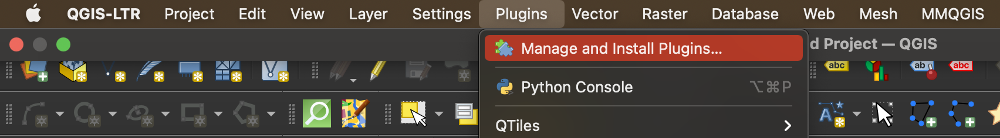
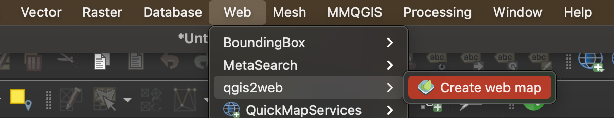
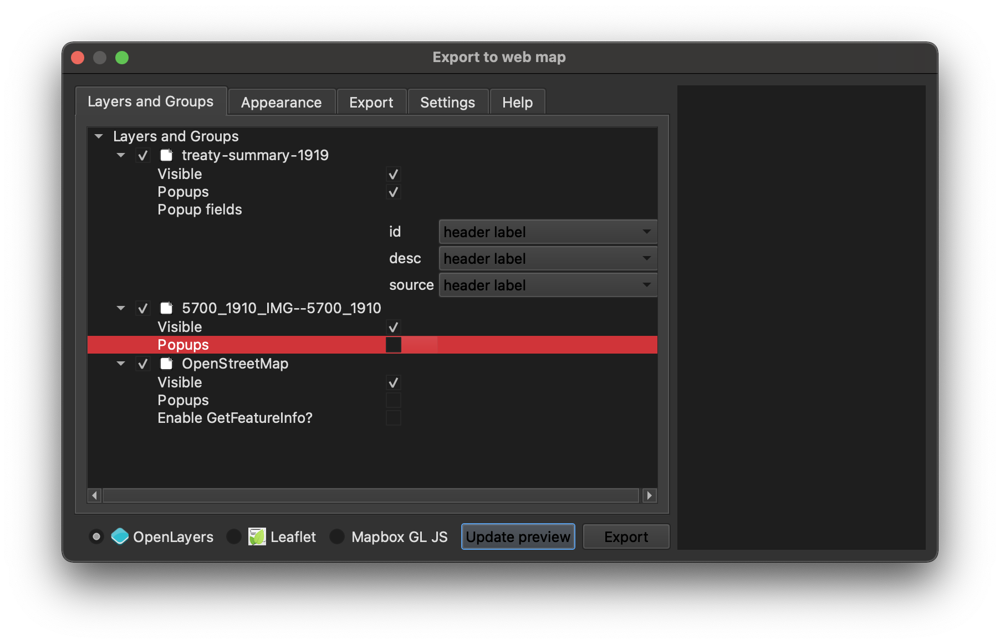
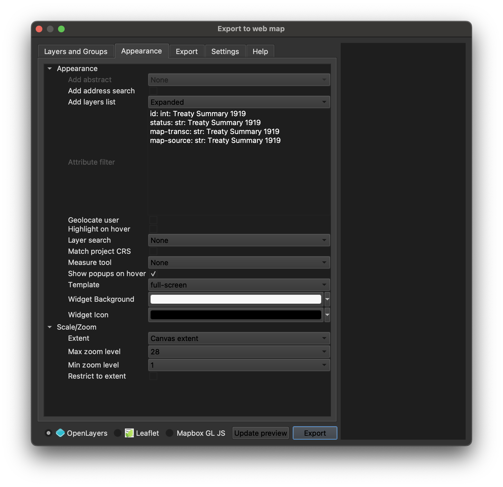

## Mapping Assignment Next Steps 

In the [first part of the mapping tutorial](https://harvardmapcollection.github.io/classes/gened1140/fall-2022/assignment/), we learned how to bring in two different kinds of GIS data into a desktop GIS program, QGIS. 

In this part of the tutorial, we will learn how to make any map you create in QGIS web-enabled. To do this, we will use a QGIS plugin called "QGIS2Web"

### Share the project as a webmap

1. In the very top QGIS program menu, select `Plugins → Manage and Install Plugins`. 

2. Search for `QGIS2Web` and select `Install plugin`.

3. In the very top QGIS program menu, select `Web → QGIS2Web → Create a webmap`. 

4. Configure the `Layers and Groups` settings as follows:

> - Make sure all of the layers are toggled on, including the basemap
- Make sure all of the layers are toggled on as `Visible`
- Toggle on `Popups` only for the `treaty-summary-1919` territories; make sure `Popups` are turned **off** for the other data layers. 
- Under `treaty-summary-1919` `Popup fields`, use the dropdowns to select `header label` for each field. 
*To learn more about configuring popups, you can follow this guide, [Web Mapping with QGIS2Web](http://www.qgistutorials.com/en/docs/web_mapping_with_qgis2web.html).*

5. Configure the `Appearance` settings as follows:

> - Under `Add layers list` select `Expanded`
- Toggle on the checkbox next to `Show popups on hover`

6. Under the `Export` tab, click the ellipsis to the right of where it says `Export to folder`. Select a place to save your webmap to. Choose somewhere easy to find. Select open.

7. Select export. It might take a few moments to complete the export. 

8. When the `Progress` bar says `Success, exported to your location`, navigate to that location in your computer files. 

9. Double-click `index.html`. The interactive webmap you created will appear in your default web browser. You can use this map to explore the relationships between nationality and political boundary-making in Europe in 1919.

### Publish the interactive map (optional)

The interactive webmap you created currently lives only on your computer. To share the link publicly (as we did with [the demo](https://harvardmapcollection.github.io/classes/gened1140/fall-2022/assignment/demo/completed-map/)), you will need to follow a few more steps. If you'd like instructions for hosting and sharing GIS webmaps, or have any other GIS project questions, don't hestitate to reach out at [maps@harvard.edu](mailto:maps@harvard.edu)