# 9/28/2022 Lecture

- computer science
- data analytics
- history
- museum studies
- urban planning

*[OldNYC: Mapping Historic Photographs at the NYPL](https://www.oldnyc.org/).* 

*1880 census from [Archive.org](https://archive.org/details/10thcensus0561unit/page/n45/mode/2up?view=theater).* 

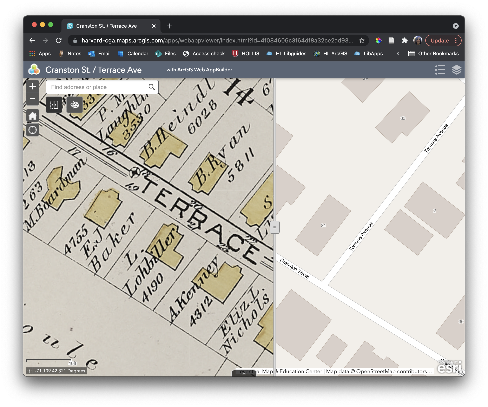
*[ArcGIS Map](https://harvard-cga.maps.arcgis.com/apps/webappviewer/index.html?id=4f084606c3f64df8a32ce2ad938a43f6) comparing 1890 atlas to today.* 

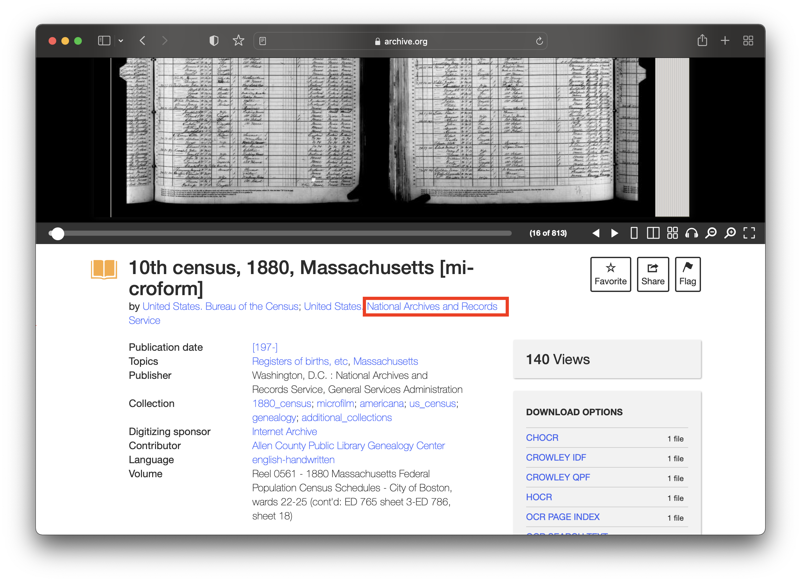
*The 1880 census microfiche is held at the National Archives.* 

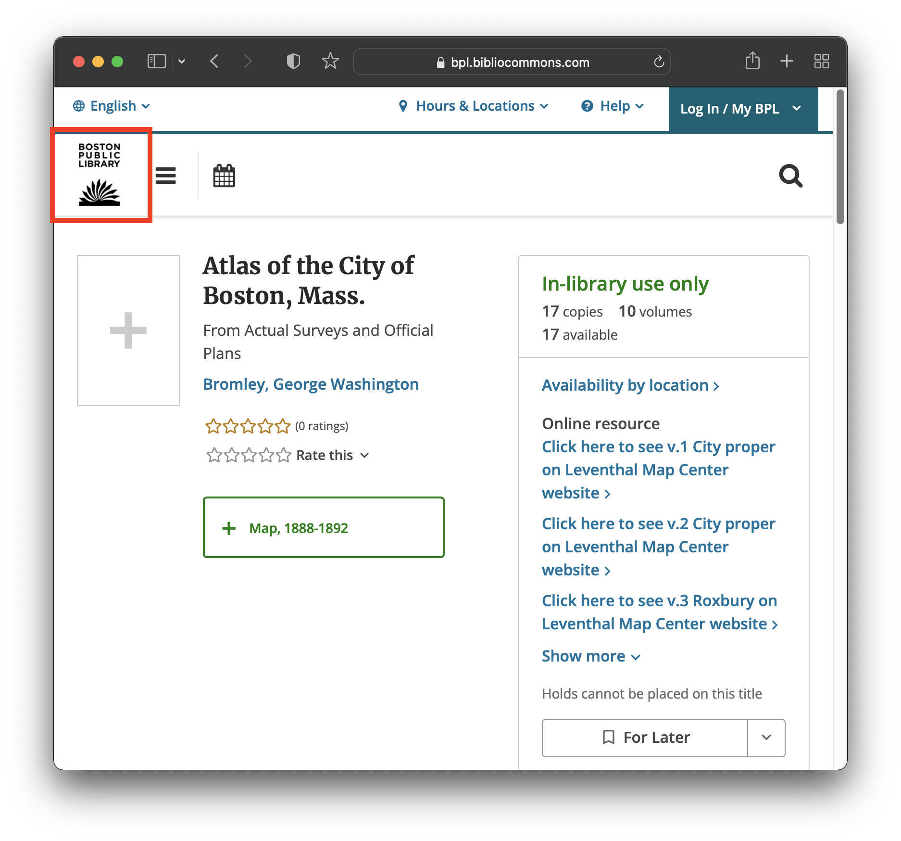
*The 1890 Boston atlas depicting the same area is held at the Boston Public Library.* 

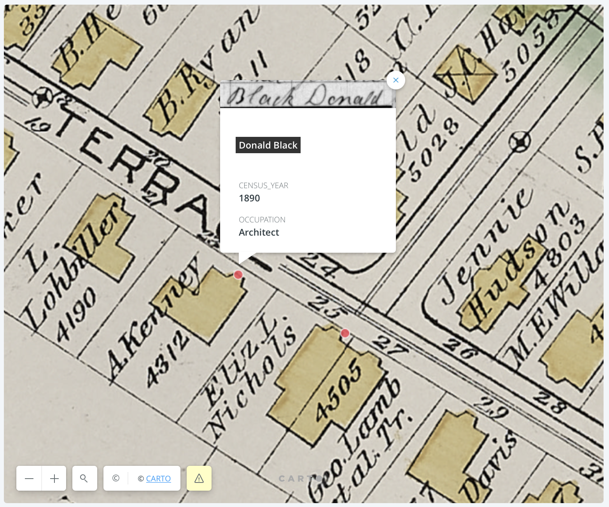
*Source materials of all kinds can be brought together based on location using GIS software.* 

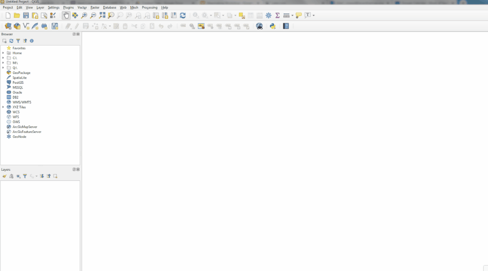
*[Understanding the QGIS Interface](https://cartinal.leventhalmap.org/guides/get-started-qgis/interface.html#menu-bar).* 

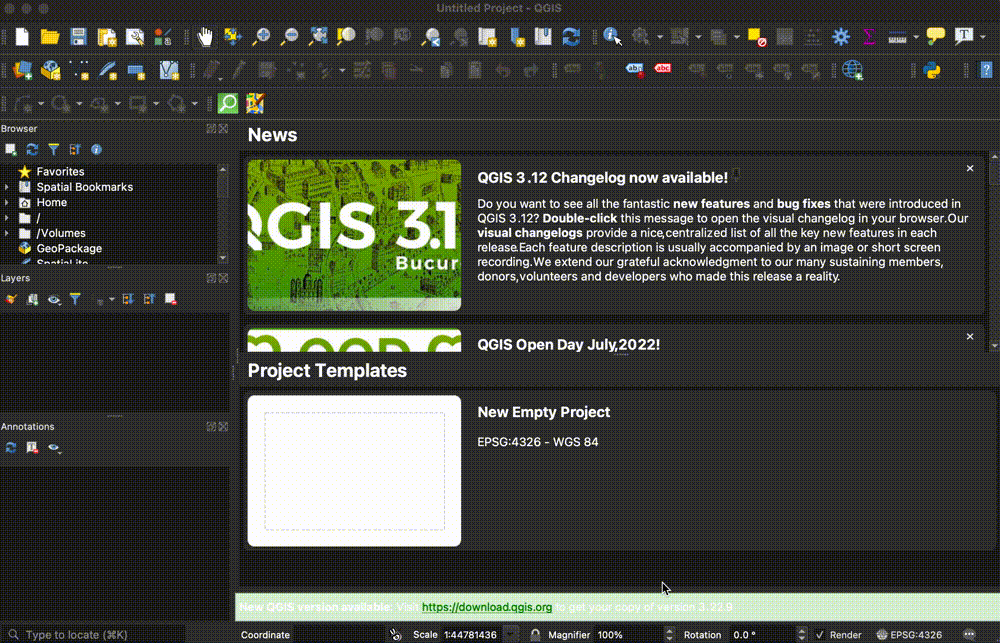
*Opening a new project in QGIS.* 

*Adding a basemap in QGIS for reference.* 

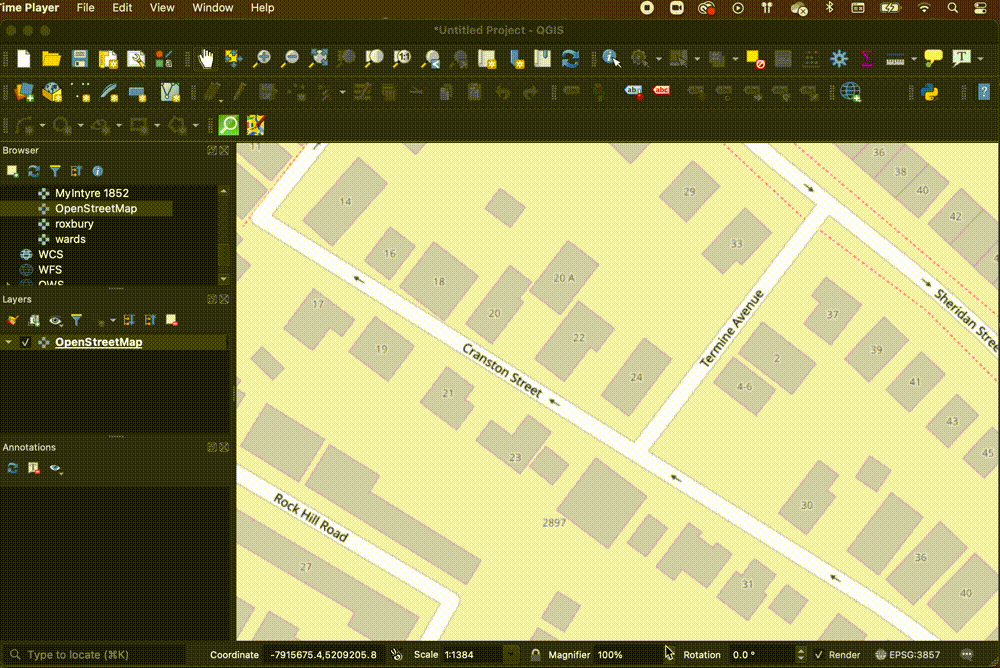
*Creating custom GIS datasets in QGIS.* 

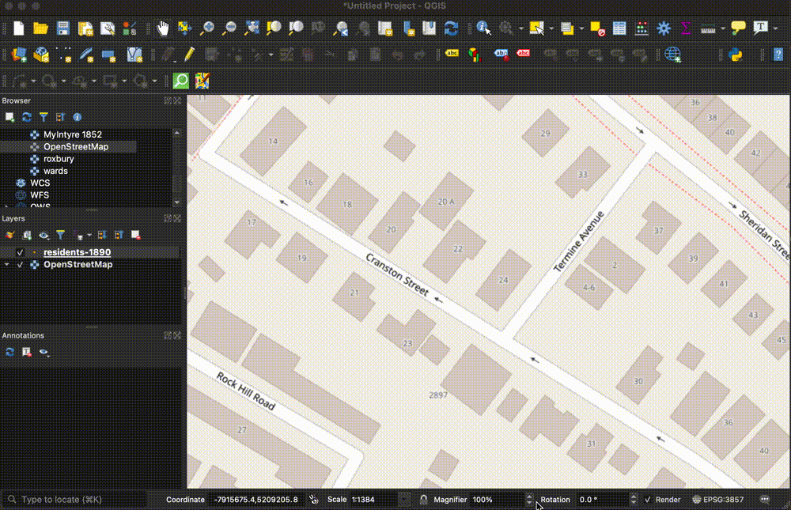
*Adding records to the newly created dataset in QGIS.* 

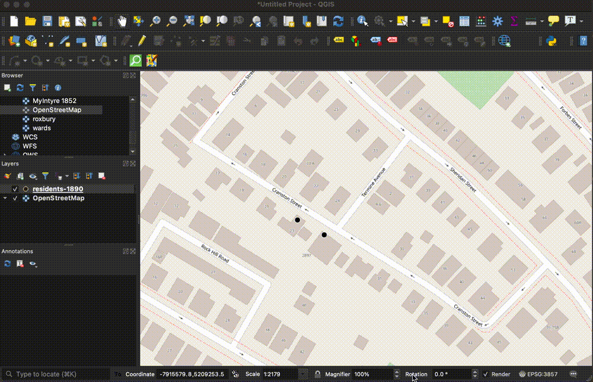
*Inspecting the data table (or **attribute table**) in QGIS.* 

*Changing the point symbology in QGIS.* 

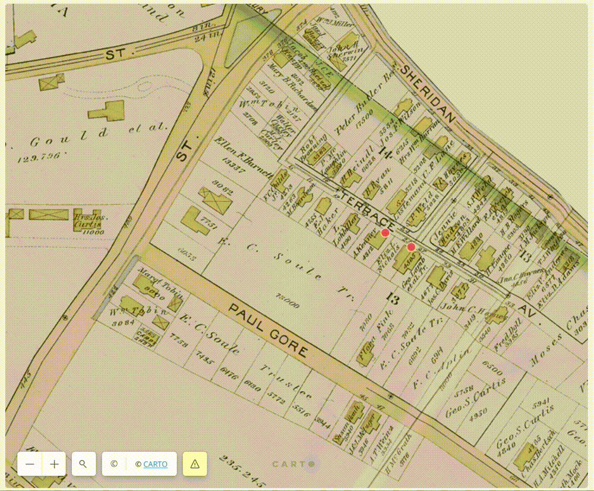
*[Sharing datasets interactively with browser mapping tools.](https://harvard.carto.com/u/bellegis/builder/902823ad-f46c-40f7-9a0a-19755efe1d38).* 

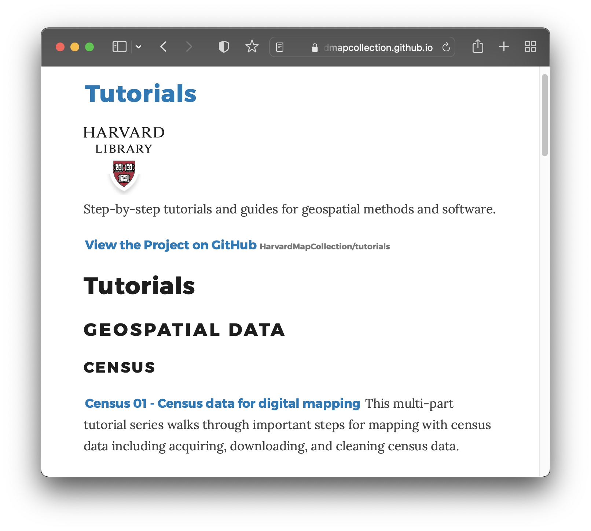
*[Harvard Map Collection tutorials](https://harvardmapcollection.github.io/tutorials/)*