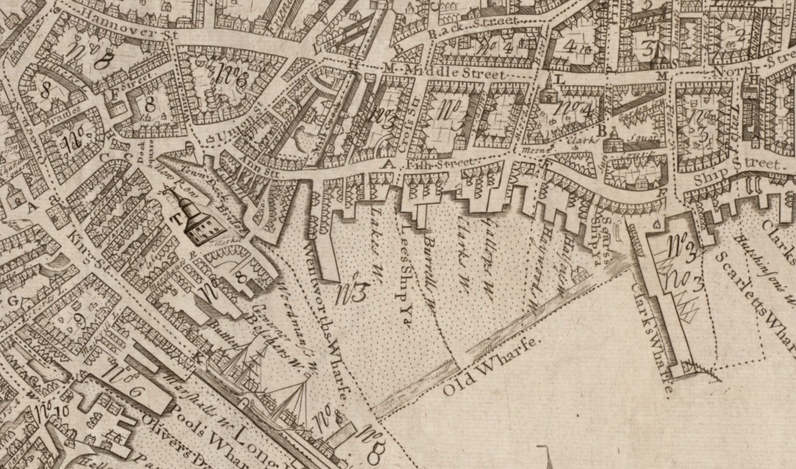
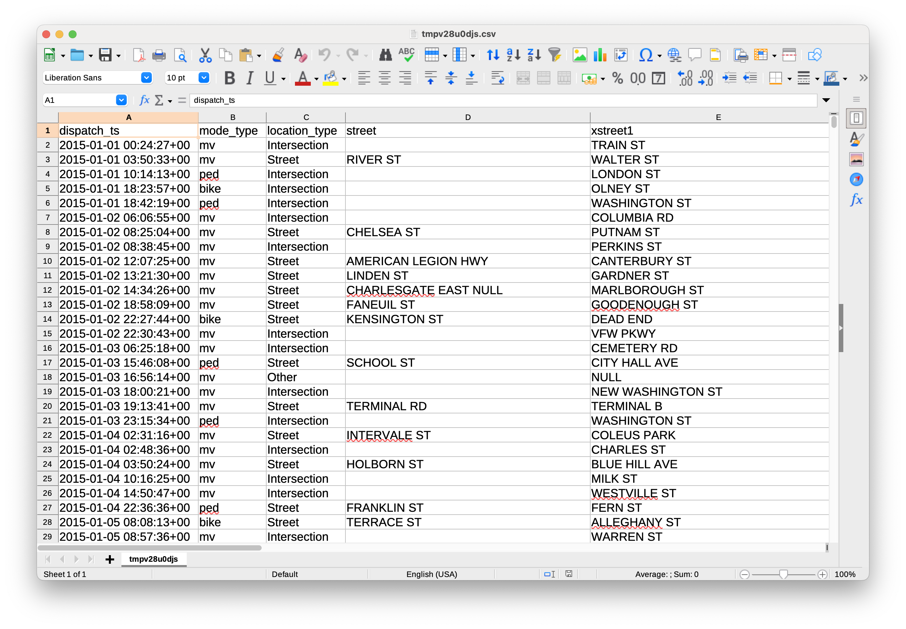
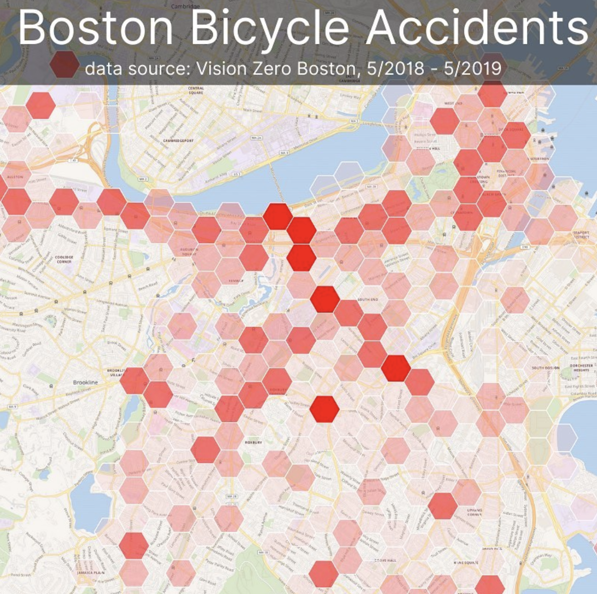
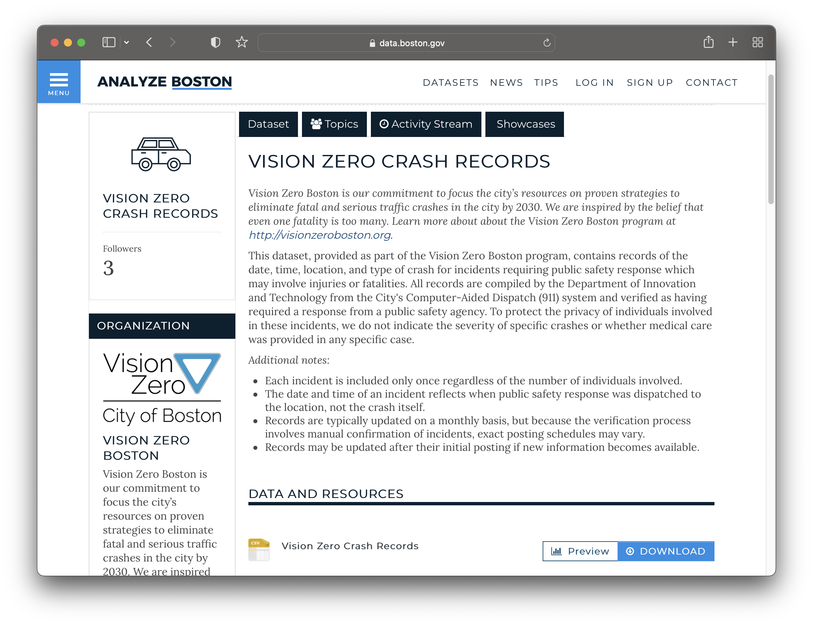

# Leveraging GIS technology

*[Map of Boston from 1743](https://collections.leventhalmap.org/search/commonwealth:9s161952m).*

*[OldNYC: Mapping Historic Photographs at the NYPL](https://www.oldnyc.org/).* 

